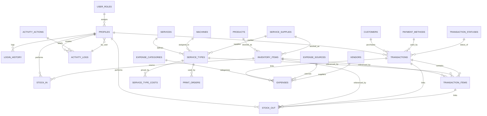

# Database ERD, Events Table, and Use Case Descriptions

## ERD of the Database



## Key Entities

- `profiles`
- `user_roles`
- `login_history`
- `products`
- `inventory_items`
- `stock_in`
- `stock_out`
- `services`
- `service_types`
- `service_type_costs`
- `machines`
- `service_supplies`
- `transactions`
- `transaction_items`
- `print_orders`
- `customers`
- `payment_methods`
- `transaction_statuses`
- `expenses`
- `expense_categories`
- `expense_sources`
- `vendors`
- `activity_logs`
- `activity_actions`

---

## Events Table for the New Database

### Product Management

| Event                | Trigger                             | Source        | Use Case              | Response                                                                        | Destination       |
| -------------------- | ----------------------------------- | ------------- | --------------------- | ------------------------------------------------------------------------------- | ----------------- |
| Add Store Product    | Owner enters new product details    | Owner         | Manage Store Products | Product record created with name, category, type, purchase price, selling price | `products`        |
| Update Store Product | Owner edits an existing product     | Owner         | Manage Store Products | Product information updated; profit margin recalculated                         | `products`        |
| Remove Store Product | Owner deletes or archives a product | Owner         | Manage Store Products | Product marked inactive or removed from catalog                                 | `products`        |
| View Store Products  | Owner/Cashier opens product catalog | Owner/Cashier | View Product Catalog  | Display all products with categories, prices, stock status                      | Product Interface |

### Service Management

| Event                     | Trigger                        | Source | Use Case                  | Response                                                                                | Destination          |
| ------------------------- | ------------------------------ | ------ | ------------------------- | --------------------------------------------------------------------------------------- | -------------------- |
| Add Print Service         | Owner adds a service           | Owner  | Manage Services           | `services` record created with service name and description                             | `services`           |
| Add Service Type          | Owner defines a variant        | Owner  | Manage Service Types      | `service_types` record created with paper size, color mode, supply, machine links       | `service_types`      |
| Set Service Type Cost     | Owner inputs cost data         | Owner  | Manage Service Type Costs | `service_type_costs` record created with supply, ink, electricity, labor, selling price | `service_type_costs` |
| Assign Machine to Service | Owner links a machine          | Owner  | Assign Service Machine    | Machine assigned to service type                                                        | `service_types`      |
| View Services             | Owner views available services | Owner  | View Service Catalog      | Display services and their variants                                                     | Service Interface    |

### Sales Transactions

| Event                       | Trigger                    | Source  | Use Case                     | Response                                                            | Destination                    |
| --------------------------- | -------------------------- | ------- | ---------------------------- | ------------------------------------------------------------------- | ------------------------------ |
| Add Product to Transaction  | Cashier selects item       | Cashier | Add Product to Transaction   | `transaction_items` row created with quantity, price, subtotal      | `transaction_items`            |
| Add Service to Transaction  | Cashier adds print job     | Cashier | Add Service to Transaction   | `transaction_items` row created with print order and cost breakdown | `transaction_items`            |
| Calculate Transaction Total | Items added to cart        | System  | Calculate Transaction Total  | Total amount and profit computed                                    | Transaction Engine             |
| Complete Transaction        | Cashier completes checkout | Cashier | Process Customer Transaction | `transactions` row created with totals and cashier link             | `transactions`                 |
| Generate Receipt            | Customer requests receipt  | Cashier | Generate Receipt             | Receipt prepared showing each item, total, profit                   | Customer                       |
| Auto-Deduct Inventory       | Transaction finalized      | System  | Adjust Inventory             | `stock_out` record created and inventory quantity reduced           | `stock_out`, `inventory_items` |

### Inventory Management

| Event                   | Trigger                            | Source        | Use Case                  | Response                                                              | Destination              |
| ----------------------- | ---------------------------------- | ------------- | ------------------------- | --------------------------------------------------------------------- | ------------------------ |
| Record Product Stock In | Owner receives product shipment    | Owner         | Record Product Stock In   | `stock_in` row created with product, quantity, purchase price, expiry | `stock_in`               |
| Record Supply Stock In  | Owner receives print supplies      | Owner         | Record Supply Stock In    | `stock_in` row created with supply, quantity, purchase price          | `stock_in`               |
| Create Inventory Item   | New stock arrives                  | System        | Create Inventory Items    | `inventory_items` created/updated with current quantity               | `inventory_items`        |
| View Inventory          | Owner/Cashier opens inventory list | Owner/Cashier | View Current Inventory    | Show current product and supply stock, expiry, reorder status         | Inventory Interface      |
| Adjust Inventory        | Owner corrects stock levels        | Owner         | Adjust Inventory Quantity | `stock_in` or `stock_out` recorded and quantities updated             | `stock_in` / `stock_out` |
| Track Expiration        | System checks expiry fields        | System        | Monitor Expiry            | Highlight items nearing expiry                                        | Inventory Interface      |

### Expense Management

| Event                     | Trigger                                          | Source | Use Case                  | Response                                                                                      | Destination            |
| ------------------------- | ------------------------------------------------ | ------ | ------------------------- | --------------------------------------------------------------------------------------------- | ---------------------- |
| Record Business Expense   | Owner enters expense details                     | Owner  | Record Expense            | `expenses` row created with amount, category, source                                          | `expenses`             |
| Manage Expense Categories | Owner adds, edits, or deletes expense categories | Owner  | Manage Expense Categories | `expense_categories` rows created, updated, or deleted; categories refreshed on Expenses page | `expense_categories`   |
| Link Expense to Stock In  | Product/supply purchase entered                  | Owner  | Link Expense to Inventory | Expense associated with `stock_in` for cost tracking                                          | `expenses`, `stock_in` |
| View Expense History      | Owner opens expenses page                        | Owner  | View Expenses             | Display expense list by date, category, amount                                                | Expense Interface      |
| Categorize Expense        | Owner chooses category                           | Owner  | Manage Expense Categories | Expense assigned to category like utilities, purchases, maintenance                           | `expense_categories`   |

### User Management

| Event               | Trigger                 | Source | Use Case                | Response                                          | Destination     |
| ------------------- | ----------------------- | ------ | ----------------------- | ------------------------------------------------- | --------------- |
| Create User Account | Owner adds new user     | Owner  | Create User Account     | Profile created with username, role, contact info | `profiles`      |
| Assign User Role    | Owner selects role      | Owner  | Assign User Role        | `user_roles` referenced by profile                | `profiles`      |
| Deactivate User     | Owner disables account  | Owner  | Deactivate User Account | `profiles.is_active` set false                    | `profiles`      |
| View User Accounts  | Owner opens user list   | Owner  | View User Accounts      | Show all users, roles, status                     | User Interface  |
| Login User          | User enters credentials | User   | Authenticate User       | `login_history` row created with login time       | `login_history` |
| Logout User         | User signs out          | User   | End Session             | `login_history.logout_time` updated               | `login_history` |

---

## Use Case Descriptions

### Use Case: Manage Store Products

| Field                | Description                                                                                                                                                                               |
| -------------------- | ----------------------------------------------------------------------------------------------------------------------------------------------------------------------------------------- |
| Use Case Name        | Manage Store Products                                                                                                                                                                     |
| Scenario             | Owner manages the item catalog for the sari-sari portion of the business                                                                                                                  |
| Triggering Event     | Owner adds, updates, or removes a store product                                                                                                                                           |
| Brief Description    | Allows the owner to create, update, archive, and list products with pricing, category, and inventory status                                                                               |
| Actors               | Owner                                                                                                                                                                                     |
| Related Use Case     | View Product Catalog                                                                                                                                                                      |
| Preconditions        | Owner is authenticated and has owner role                                                                                                                                                 |
| Postconditions       | `products` table is updated with new/edited product data                                                                                                                                  |
| Flow of Activities   | 1. Owner opens product management page<br>2. Owner enters or modifies product details<br>3. System validates input<br>4. System saves to `products`<br>5. System displays updated catalog |
| Exception Conditions | Invalid price or missing required field prevents save; duplicate product names may show warning                                                                                           |

### Use Case: Process Customer Transaction

| Field                | Description                                                                                                                                                                                                                                                                                                  |
| -------------------- | ------------------------------------------------------------------------------------------------------------------------------------------------------------------------------------------------------------------------------------------------------------------------------------------------------------ |
| Use Case Name        | Process Customer Transaction                                                                                                                                                                                                                                                                                 |
| Scenario             | Cashier completes a sale that may include store items and printing services                                                                                                                                                                                                                                  |
| Triggering Event     | Cashier confirms checkout at POS                                                                                                                                                                                                                                                                             |
| Brief Description    | Records transaction, itemizes sale lines, calculates totals, generates receipt, and updates inventory                                                                                                                                                                                                        |
| Actors               | Cashier                                                                                                                                                                                                                                                                                                      |
| Related Use Case     | Add Product to Transaction; Add Service to Transaction; Auto-Deduct Inventory                                                                                                                                                                                                                                |
| Preconditions        | Cashier is authenticated; cart contains at least one item                                                                                                                                                                                                                                                    |
| Postconditions       | New `transactions` and `transaction_items` rows created; inventory reduced; `stock_out` recorded                                                                                                                                                                                                             |
| Flow of Activities   | 1. Cashier adds products/services to cart<br>2. System calculates subtotal and profit<br>3. Cashier selects payment method and confirms sale<br>4. System creates `transactions` record<br>5. System creates `transaction_items` rows<br>6. System decreases `inventory_items` stock and records `stock_out` |
| Exception Conditions | Insufficient item stock; invalid payment method; transaction save failure                                                                                                                                                                                                                                    |

### Use Case: Record Product Stock In

| Field                | Description                                                                                                                                                                                                                                    |
| -------------------- | ---------------------------------------------------------------------------------------------------------------------------------------------------------------------------------------------------------------------------------------------- |
| Use Case Name        | Record Product Stock In                                                                                                                                                                                                                        |
| Scenario             | Owner receives new product inventory or print supplies                                                                                                                                                                                         |
| Triggering Event     | Owner submits stock-in form                                                                                                                                                                                                                    |
| Brief Description    | Records inbound stock through `stock_in`, updates `inventory_items`, and links expense if appropriate                                                                                                                                          |
| Actors               | Owner                                                                                                                                                                                                                                          |
| Related Use Case     | Create Inventory Items; Link Expense to Stock In                                                                                                                                                                                               |
| Preconditions        | Owner is authenticated; product or supply exists                                                                                                                                                                                               |
| Postconditions       | `stock_in` inserted; `inventory_items` updated or created                                                                                                                                                                                      |
| Flow of Activities   | 1. Owner selects product or supply<br>2. Owner enters quantity, purchase price, expiry (if any)<br>3. System saves `stock_in`<br>4. System updates or creates corresponding `inventory_items` row<br>5. System optionally links expense record |
| Exception Conditions | Missing item selection; invalid quantity; duplicate inventory batch conflict                                                                                                                                                                   |

### Use Case: Record Business Expense

| Field                | Description                                                                                                                                                                                                    |
| -------------------- | -------------------------------------------------------------------------------------------------------------------------------------------------------------------------------------------------------------- |
| Use Case Name        | Record Business Expense                                                                                                                                                                                        |
| Scenario             | Owner logs expenses for purchases, utilities, or operational costs                                                                                                                                             |
| Triggering Event     | Owner enters an expense record                                                                                                                                                                                 |
| Brief Description    | Captures financial outflows with category, amount, source, and optional linked transaction                                                                                                                     |
| Actors               | Owner                                                                                                                                                                                                          |
| Related Use Case     | View Expense History; Link Expense to Stock In                                                                                                                                                                 |
| Preconditions        | Owner is authenticated                                                                                                                                                                                         |
| Postconditions       | `expenses` row created and categorized                                                                                                                                                                         |
| Flow of Activities   | 1. Owner opens expense entry screen<br>2. Owner selects category and source<br>3. Owner enters amount, date, description<br>4. System validates and saves `expenses`<br>5. System updates expense history view |
| Exception Conditions | Missing amount or category; invalid date; unauthorized access                                                                                                                                                  |

### Use Case: Manage Expense Categories

| Field                | Description                                                                                                                                                                                                           |
| -------------------- | --------------------------------------------------------------------------------------------------------------------------------------------------------------------------------------------------------------------- |
| Use Case Name        | Manage Expense Categories                                                                                                                                                                                             |
| Scenario             | Owner creates, updates, or deletes expense categories                                                                                                                                                                 |
| Triggering Event     | Owner selects category management controls on the Expenses page                                                                                                                                                       |
| Brief Description    | Allows the owner to maintain expense categories used for grouping and reporting                                                                                                                                       |
| Actors               | Owner                                                                                                                                                                                                                 |
| Related Use Case     | Record Business Expense; View Expense History                                                                                                                                                                         |
| Preconditions        | Owner is authenticated and has access to expense settings                                                                                                                                                             |
| Postconditions       | `expense_categories` rows are created, updated, or removed; category list refreshes in the Expenses page                                                                                                              |
| Flow of Activities   | 1. Owner opens expense categories section<br>2. Owner adds, edits, or deletes a category<br>3. System validates input<br>4. System saves changes to `expense_categories`<br>5. System refreshes expense category list |
| Exception Conditions | Duplicate category name; empty category name; unauthorized modification                                                                                                                                               |

### Use Case: Manage User Accounts

| Field                | Description                                                                                                                                                                                                                     |
| -------------------- | ------------------------------------------------------------------------------------------------------------------------------------------------------------------------------------------------------------------------------- |
| Use Case Name        | Manage User Accounts                                                                                                                                                                                                            |
| Scenario             | Owner maintains cashier and owner user profiles                                                                                                                                                                                 |
| Triggering Event     | Owner creates, updates, or deactivates a user                                                                                                                                                                                   |
| Brief Description    | Handles user creation, role assignment, profile editing, and account activation status                                                                                                                                          |
| Actors               | Owner                                                                                                                                                                                                                           |
| Related Use Case     | Authenticate User; Track Login History                                                                                                                                                                                          |
| Preconditions        | Owner is authenticated                                                                                                                                                                                                          |
| Postconditions       | `profiles` updated; `user_roles` enforced; inactive accounts blocked                                                                                                                                                            |
| Flow of Activities   | 1. Owner opens user management screen<br>2. Owner enters user details and selects role<br>3. System validates username and email<br>4. System saves profile to `profiles`<br>5. System updates active/inactive status as needed |
| Exception Conditions | Duplicate username/email; invalid role selection; unauthorized modification                                                                                                                                                     |

---

## Use Case Diagram Example

```mermaid
%%{init: {'theme': 'base'}}%%
usecaseDiagram
  actor Cashier
  actor Owner

  Cashier --> (Add Product to Transaction)
  Cashier --> (Add Service to Transaction)
  Cashier --> (Process Payment)
  Cashier --> (Generate Receipt)
  Cashier --> (View Transaction History)

  (Process Payment) ..> (Calculate Transaction Total) : <<include>>
  (Process Payment) ..> (Auto-Deduct Inventory) : <<include>>
  (Generate Receipt) ..> (Calculate Transaction Total) : <<include>>
```
