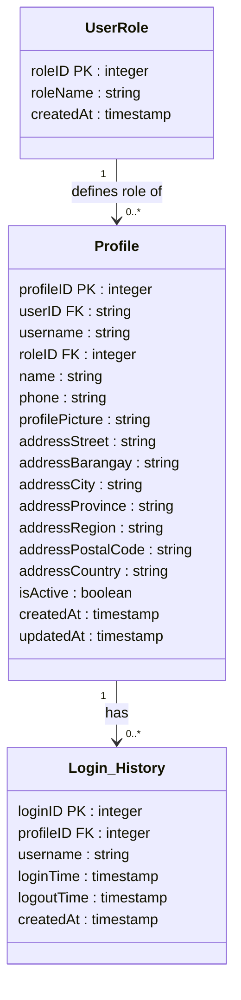
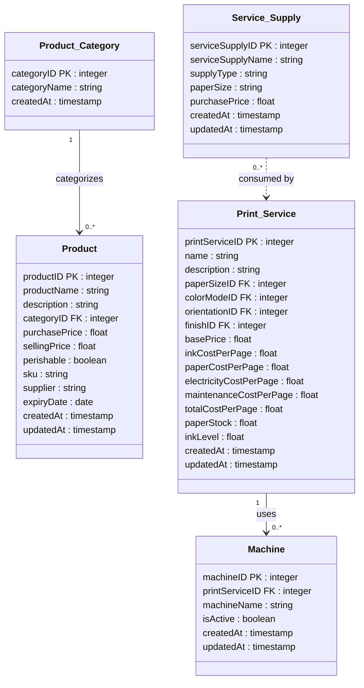
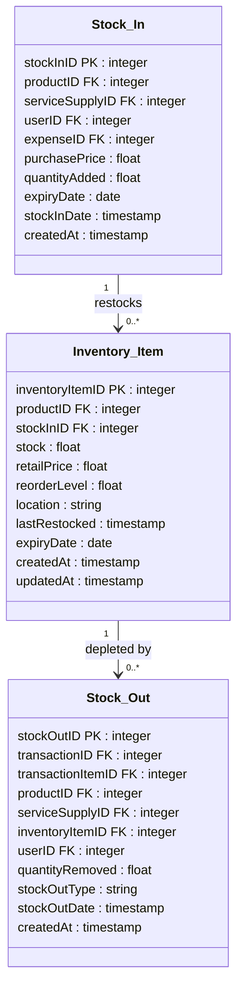

# Updated Design Class Diagrams
> Replace the corresponding diagrams on pages 40–42 of the paper with the ones below.
> Render with any Mermaid-compatible tool (e.g. mermaid.live, VS Code Mermaid Preview, or Notion).

---

## 5.1 User Management

---

## 5.2 Product Management

---

## 5.3 Inventory Management

---

## 5.4 Transaction Sales

```mermaid
classDiagram
    class Customer {
        customerID PK : integer
        name : string
        createdAt : timestamp
        updatedAt : timestamp
    }

    class Transaction {
        transactionID PK : integer
        transactionNumber : string
        cashierID FK : integer
        customerID FK : integer
        paymentMethodID FK : integer
        statusID FK : integer
        subtotal : float
        tax : float
        discount : float
        total : float
        storeRevenue : float
        printingRevenue : float
        totalCost : float
        grossProfit : float
        notes : string
        date : timestamp
        createdAt : timestamp
        updatedAt : timestamp
    }

    class Transaction_Item {
        transactionItemID PK : integer
        transactionID FK : integer
        productID FK : integer
        inventoryID FK : integer
        printOrderID FK : integer
        categoryID FK : integer
        productName : string
        quantity : float
        unitPrice : float
        discount : float
        itemCost : float
        subtotal : float
        createdAt : timestamp
        updatedAt : timestamp
    }

    class Print_Order {
        printOrderID PK : integer
        printServiceID FK : integer
        quantity : integer
        copies : integer
        doubleSided : boolean
        additionalFinishID FK : integer
        totalPrice : float
        inkUsed : float
        paperUsed : float
        electricityUsed : float
        totalCost : float
        profitMargin : float
        createdAt : timestamp
        updatedAt : timestamp
    }

    Customer "0..1" --> "0..*" Transaction : places
    Transaction "1" --> "0..*" Transaction_Item : contains
    Transaction_Item "0..1" --> "0..1" Print_Order : references
```

